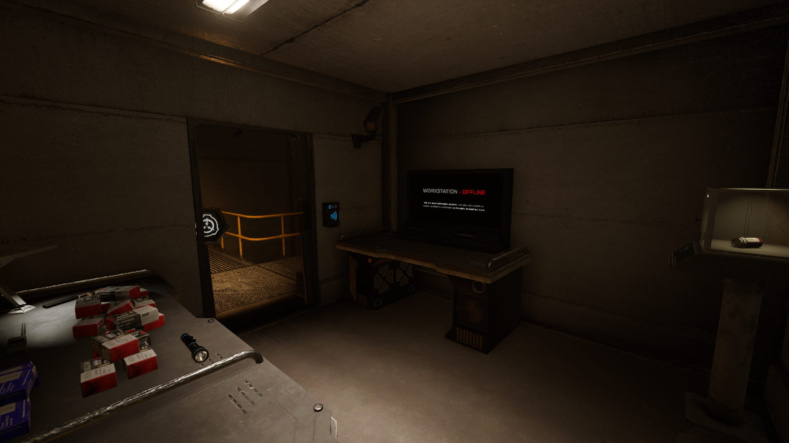
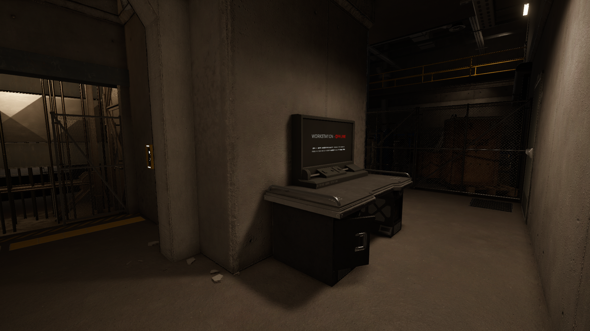
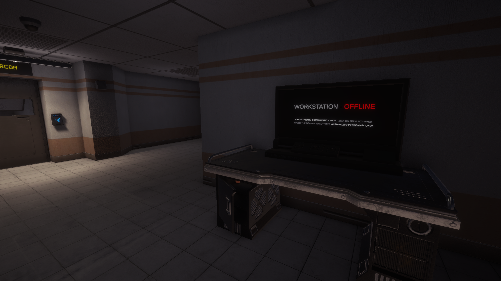
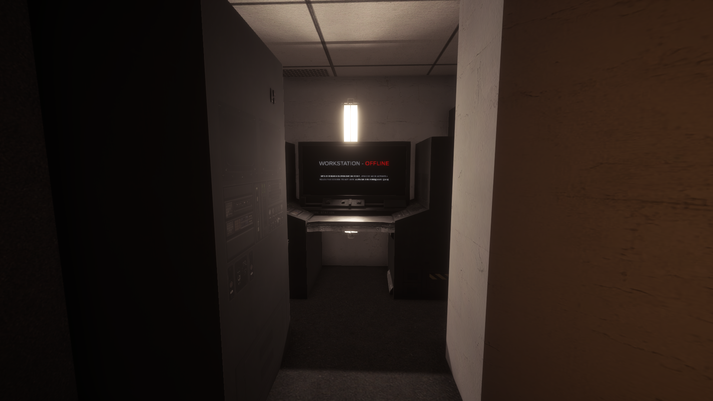
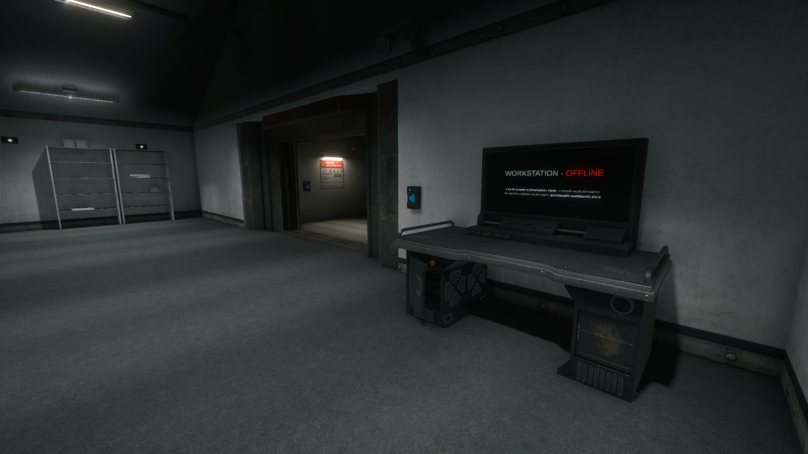
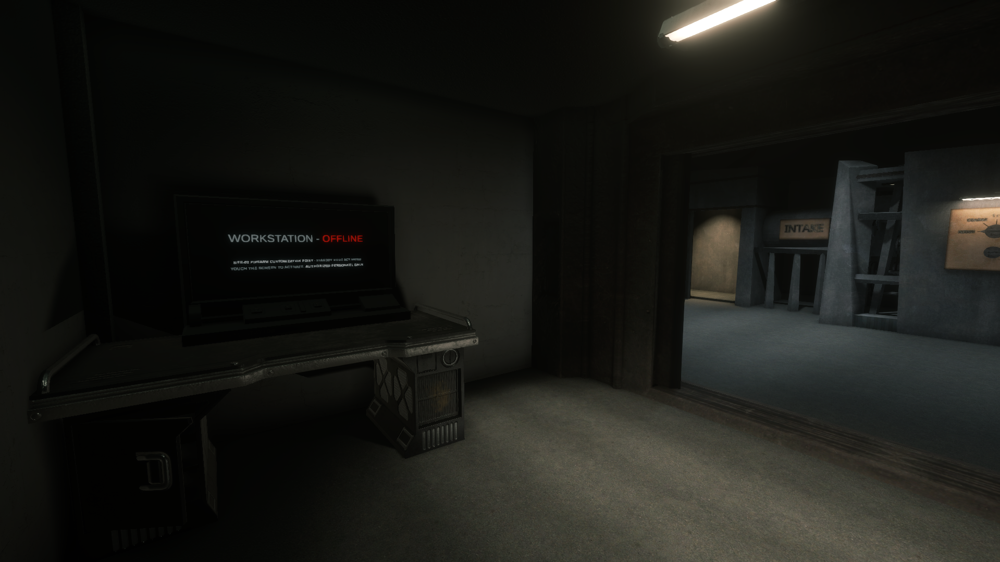

[](https://github.com/FrikandelbroodjeCommunity/CameraSystem-LabAPI/releases/latest)
[](https://github.com/northwood-studios/LabAPI)
[](https://github.com/intjiraya/CameraSystem)
[](https://github.com/FrikandelbroodjeCommunity/CameraSystem-LabAPI/blob/master/LICENSE)

# About CameraSystem

A plugin that allows players to connect to the facility's security camera system via special workstations.

- Customizable camera workstations placed throughout the facility
- Players maintain their original appearance via NPC clones while viewing cameras
- Full integration with SCP-079's camera system
- Blocks inappropriate actions while viewing cameras
- Flexible configuration with both room-based and absolute positioning

# Installation

Place the [latest release](https://github.com/gamendegamer321/CameraSystem-LabAPI/releases/latest) in the LabAPI plugin folder.

# Usage

1. Approach a configured workstation
2. Activate it by interacting (default: E key)
3. You'll enter camera view while your physical body remains at the workstation
4. Press the interact button (E) again to exit camera view

# Config

```yaml
camera_system:
  is_camera_system_enabled_by_default: true
  preset_configs:
  - room_type: EzIntercom
    local_position: {x: -6.9, y: -5.8, z: 1.2}
    local_rotation: {x: 0, y: 90, z: 0}
    scale: {x: 1, y: 1, z: 0.7}
  workstations:
  - position: {x: 0, y: 0, z: 0}
    rotation: {x: 0, y: 0, z: 0}
    scale: {x: 1, y: 1, z: 1}
```

## Preset Configuration Guide

The plugin offers two ways to place workstations:

### 1. Room-based Presets

```yaml
preset_configs:
  - room_type: RoomType       # The room where workstation will spawn (e.g. HczArmory)
    local_position: Vector3   # Position relative to room
    local_rotation: Vector3   # Rotation relative to room
    scale: Vector3            # Workstation scale
```

Benefits:
- Automatically adapts to room position changes
- Easier to configure (positions are relative to room)
- More intuitive placement

Previous presets are now available as room-based configurations:

| Old Preset | New RoomType | Local Position    | Local Rotation | Scale       |
|------------|--------------|-------------------|----------------|-------------|
| HczArmory  | HczArmory    | (1.1, 0, 2.1)     | (0, 180, 0)    | (1, 1, 1)   |
| Intercom   | EzIntercom   | (-5.4, 0, -1.8)   | (0, 0, 0)      | (1, 1, 1)   |
| Intercom2  | EzIntercom   | (-6.9, -5.8, 1.2) | (0, 90, 0)     | (1, 1, 0.7) |
| Nuke       | HczNuke      | (2, -72.4, 8.5)   | (0, 0, 0)      | (1, 1, 1)   |
| Scp914     | Lcz914       | (-1.9, 0, 5.5)    | (0, 90, 0)     | (1, 1, 1)   |
| Scp9142    | Lcz914       | (-6.2, 0, 3.1)    | (0, 180, 0)    | (1, 1, 1)   |

### 2. Absolute Position Workstations

```yaml
workstations:
  - position: Vector3         # Absolute world position
    rotation: Vector3         # Absolute rotation
    scale: Vector3            # Workstation scale
```

## Preset Locations

Here are the default preset locations with screenshots:

<table>
  <tr>
    <td align="center">
      <br>
      HczArmory preset
    </td>
    <td align="center">
      <br>
      Nuke preset
    </td>
  </tr>
  <tr>
    <td align="center">
      <br>
      Intercom preset
    </td>
    <td align="center">
      <br>
      Intercom2 preset
    </td>
  </tr>
  <tr>
    <td align="center">
      <br>
      Scp914 preset
    </td>
    <td align="center">
      <br>
      Scp9142 preset
    </td>
  </tr>
</table>